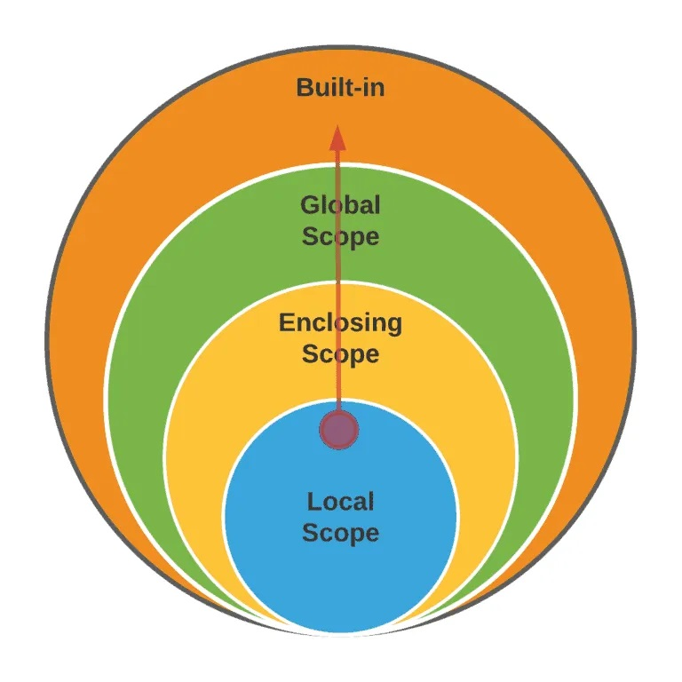

# 함수의 기초
## 함수의 정의

- 특정한 기능을 한느 코드의 조각(묶음).
특정 코드를 매번 다시 작성하지 않고, 필요시에만 호출하여 간편히 사용

</br>

## 함수의 종류

- 내장함수 : 파이썬에 기본적으로 포함된 함수
- 외장함수 : import문을 통해 사용하며, 외부 라이브러리에서 제공하는 함수
- 사용자 정의 함수 : 사용자가 직접 만드는 함수

</br>

## 선언과 호출

```python
# 함수를 선언할 땐 def을 붙이고 함수명을 적어야 함. (define)
# 함수에는 parameter가 필요.

def function_name(parameter):
		returning_value=True
		return returning_value

function_name(argument) # 함수 호출

```
</br>


## 함수의 입력

- **Parameter** : 함수를 정의할 때, 함수 내부에서 사용되는 변수
- **Argument** : 함수를 호출할 때 넣어주는 값
    - Positonal Argument : Argument 위치에 맞게 순서대로 전달하는 것.
    - Keyword Argument : 직접 변수의 이름으로 특정 Argument를 전달 가능
    - Default Argument Values : argument의 디폴트값을 설정 가능
    - **Asterisk(*)** : 가변인자/ 가변 키워드 인자를 설정 가능
        - *Asterisk와 가변인자 / 가변 키워드 인자*
            - **가변인자(args)**
                - 는 시퀸스 언패킹 연산자라고도 불리며, 시퀸스를 풀어 헤치는 연산자
                - 주로 튜플이나 리스트를 언패킹하는데 사용
                - parameter 앞에 * 를 붙여 가변인자를 만들 수 있음
                - 가변인자는 Optional이기 때문에, 값이 들어가지 않아도 됨.
                
                ```python
                def func(*args):
                    print(args)
                    print(type(args))
                
                func(1,2,3,'a','b')
                # (1,2,3,'a','b')
                # <class 'tuple'>
                
                # 가변인자는 값이 들어가지 않아도 상관 없음.
                def family(mother, father, *pets): # *pets은 옵션
                		print(mother)
                		print(father)
                		print(pets)
                
                family('엄마', '아빠')
                # 엄마
                # 아빠
                
                ```
                
            
            - **가변 키워드 인자(kwargs)**
                - 몇 개의 키워드 인자를 받을지 모르는 함수를 정의할 때 유용
                - `*kwargs`는 딕셔너리로 묶여 처리되며, parameter 앞에 **를 붙여 표현
                
                ```python
                # 가변 키워드 인자 사용법
                def family(**kwargs):
                		for key, value in kwrgs.items():
                				print(key, ':', value)
                family(father='아버지',mother='엄마',baby='아기')
                # 변수를 선언하듯, 따옴표를 붙이지 말아야 함.
                
                # 가변 키워드 인자 활용
                def family(mother, father, **pets):
                    print(father, mother)
                		if pets:        # pets이 있으면 작업
                				for species, name in kwrgs.items():
                						print(species, ':', name)
                family('아버지', '엄마', dog='개', cat='고양이')
                
                ```
                
                ---
                

```python
# 1. Positional Argument
def function(a, b): # a, b는 Parameter
    return a+b

c, d = 5, 5
function(c, d)  # c, d는 Argument

# 2. Keyword Argument
function(c=5, d=5)
function(c, d=5)
function(c=5, d) # <= 오류 발생
# keyword argument를 사용하는 순간 그 이후의 아규먼트는 모두 키워드를 사용해야 함

# 3. Default argument values:
def function_default_value(x, y=0):
		return x+y
function_default_value(3)

```
</br>


## **패킹/언패킹**

- 패킹 : 여러 개의 데이터를 묶어서 변수에 할당하는 것
- 언패킹 : 시퀀스 속의 요소들을 여러개의 변수에 나누어 할당하는 것.

```python
# 패킹
numbers=(1,2,3,4,5)
print(numbers) # (1,2,3,4,5)

# 언패킹
a,b,c,d,e=numbers
print(a,b,c,d,e) # 1,2,3,4,5

```
</br>

<aside>
📢 **단, 언패킹시 변수의 개수와 할당하고자 하는 요소의 갯수가 동일해야 함.**

</aside>

```python
# 언패킹시 변수의 개수와 할당하고자 하는 요소가 다르면 오류가 발생
numbers=(1,2,3,4,5)
a,b,c,d,e,f = numbers # ValueError: not eough values to unpack

# Asterisk를 이용한 가변인자 활용 (함수의 입력에서 자세히 다룸)
a,b,*rest = numbers
print(a,b,rest) # 1 2 (3,4,5)

c,*args,d = numbers
print(c,args,d) # 1 (2,3,4) 5

```
</br>

## 함수의 출력

- **Void Function**
    - 명시적인 return 값이 없는 경우, None을 반환하고 종료
- **Value returning function**
    - 함수 실행 후, return문을 통해 값 반환
    - return을 하게 되면, 값 반환 후 함수가 바로 종료
- **print함수와 return의 차이**
    - print를 사용하면 호출될 때마다 값이 출력됨
    - 데이터 처리를 위해서는 return을 사용해야 함.

</br></br>

# 함수 심화

함수는 코드 내부에 Local scope를 생성하며, 그 외의 공간은 global scope로 구분

</br>

## Python의 범위

- **scope**
    - global scope : 코드 어디에서든 참조할 수 있는 공간
    - local scope : 함수가 만든 scope. 함수 내부에서만 참조 가능
- **variable**
    - global variable : global scope에 정의된 변수
    - local variable : local scope에 정의된 변수

</br>

## 변수 수명 주기(lifecycle)

- 변수는 각자 수명주기(lifecycle)가 존재
    - **built-in scope** : 파이썬이 실행된 이후부터 영원히 유지
    - **global scope** : 모듈이 호출된 시점 이후 혹은 인터프리터가 끝날 때까지 유지
    - **local scope** : 함수가 호출될 때 생성되고, 함수가 종료될 때까지 유지
    
    ```python
    def func():
        a = 20  # local scope에만 존재하는 변수 a
        print('local', a) # local 20
    
    func()
    print('global', a) # NameError: name 'a' is not defined
    ```
    
</br>

## 이름 검색 규칙(Name Resolution)



- 파이썬에서 사용되는 이름(식별자)들은 이름공간(namespace)에 저장되어 있음
- 아래와 같은 순서로 이름을 찾아나가며, LEGB Rule이라고 부름
    - **L**ocal scope : 지역 범위(현재 작업 중인 범위)
    - **E**nclosed scope : 지역 범위 한 단계 위 범위
    - **G**lobal scope : 최상단에 위치한 범위
    - **B**uilt-in scope : 모든 것을 담고 있는 범위 (정의하지 않고 사용할 수 있는 모든 것)
        - ex) `print()`

<aside>
📢 **함수 내에서는 바깥 Scope의 변수에 접근 가능하나 수정은 할 수 없음.** 
단, 상위 scope에 있는 변수를 수정하고 싶다면, `global`, `nonlocal` 활용시 가능

</aside>

```python
a = 0
b = 1
def enclosed():
    a = 10
    c = 3
    def local(c):
        print(a, b, c) # 10 1 300
    local(300)
    print(a, b, c) # 10 1 3
enclosed()
print(a, b) # 0 1
```
</br>

## global 문

현재 코드 블록 전체에 적용되며, 나열된 식별자(이름)가 global variable임을 나타냄

- `global`에 나열된 이름은 같은 코드 블록에서 `global` 앞에 등장할 수 없음
- `global`에 나열된 이름은 parameter, for 루프 대상, 클래스/함수 정의 등으로 정의되지 않아야 함

```python
a = 10
def func()
    global a
    a = 3
print(a) # 10
func()
print(a) # 3
```
</br>

- global 관련 주의사항
    
    ```python
    # 1. global에 나열된 이름은 같은 코드 블록에서 global 앞에 등장할 수 없음.
    a = 10
    def func():
        print(a) # global a 선언 전에 사용
        global a
        a = 3
    print(3)
    func()
    print(a)
    # SyntaxError: name 'a' is used prior to global declaration
    
    # 2. global에 나열된 이름은 parameter, for 루프 대상, 클래스/함수 정의 등으로 
    #    정의되지 않아야 함
    b = 10
    def func1(b)
        global b # parameter에 global 사용 불가
        b = 3
    print(b)
    func1(b)
    print(b)
    # SyntaxError: name 'b' is parameter and global
    ```
    </br>

## nonlocal 문

- `global`을 제외하고 가장 가까운 (둘러 싸고 있는) scope의 변수를 연결하도록 함
    - `nonlocal`에 나열된 이름은 같은 코드 블록에서 nonlocal 앞에 등장할 수 없음
    - `nonlocal`에 나열된 이름은 parameter, for 루프 대상, 클래스/함수 정의 등으로 정의되지 않아야 함
- `global`과 달리 이미 존재하는 이름과의 연결만 가능

```python
x = 0
def func1():
    x = 1
    def func2():
        nonlocal x  # enclosed scope(func1)의 변수 x에 영향
        x = 2       # enclosed scope(func1)의 변수 x를 2로 변경
    func2()
    print(x) # 2
func1()
print(x) # 0
```
</br>

## global, nonlocal 비교

```python
# 선언된 적 없는 변수의 활용
def func():
    global out
    out = 3
func()
print(out) # 3

```

```python
# 선언된 적 없는 변수의 활용
def func1():
    def func2():
        nonlocal y
        y = 2
    func2()
    print(y)
func1()
''' 
SyntaxError: no binding for 
nonlocal 'y' found
'''
```

<aside>
📢 `nonlocal`은 이름 공간상에 존재하는 변수만 가능

</aside>

</br></br>

## 함수의 범위 주의

- 기본적으로 함수에서 선언된 변수는 Local scope에 생성, 함수 종료 시 사라짐
- 해당 scope에 변수가 없는 경우, LEGB 룰에 따라 이름을 검색함
    - 변수에 접근은 가능하나, 수정은 불가능.
    이는, 값을 할당하는 경우 해당 scope의 이름공간에 새롭게 생성되기 때문
    - 함수 내에서 필요한 상위 scope 변수는 되도록 arument로 넘겨서 활용할 것.
- 상위 scope에 있는 변수를 수정하고 싶다면, `global`, `nonlocal` 키워드 사용
    - 단, 코드가 길어질 수록 변수의 추적이 어렵고, 예기치 못한 오류 발생 가능
    - **가급적 사용하지 않는 것을 권장, 함수로 값을 바꾸고자 한다면 항상  argument로 넘기고 return 값을 사용하는 것을 추천**

